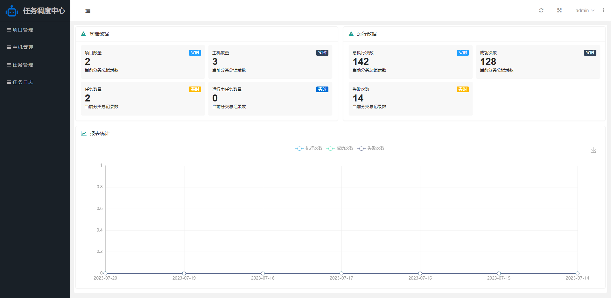
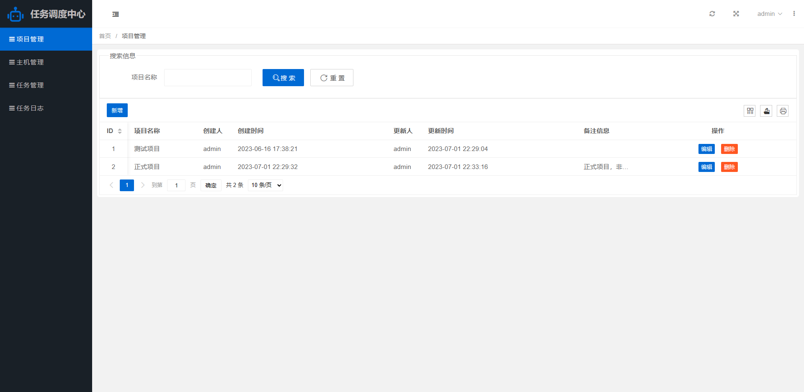
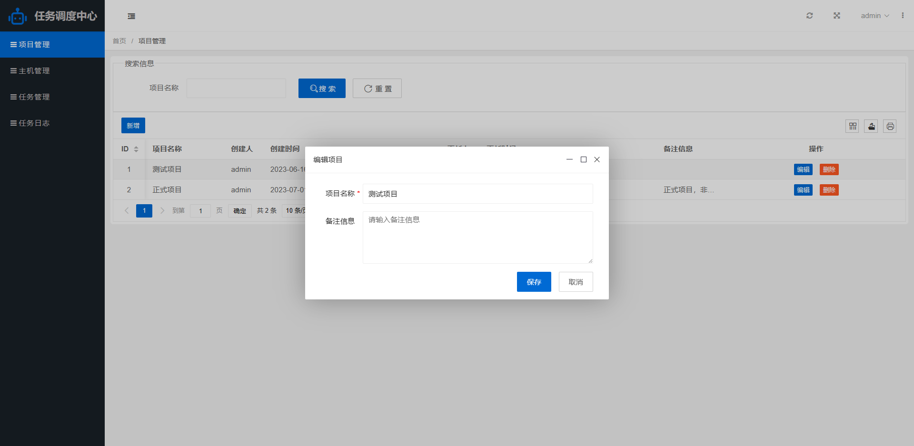
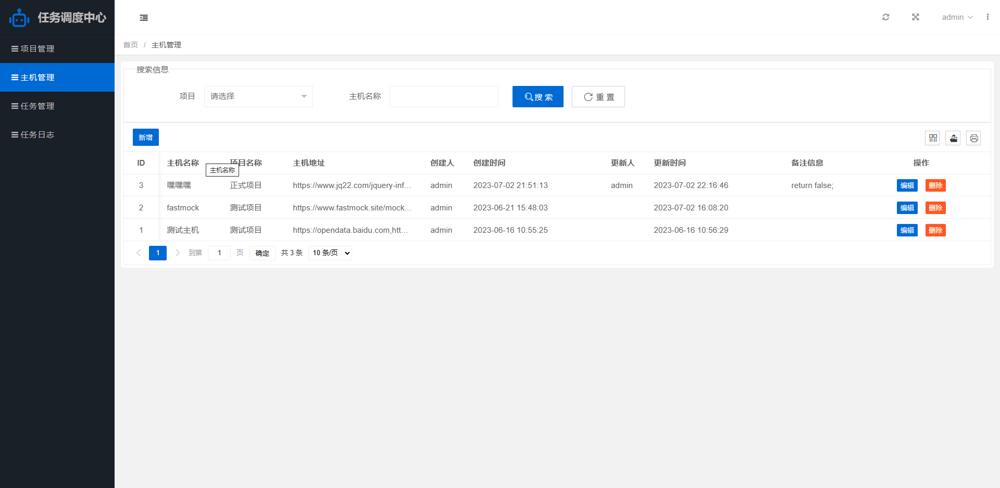
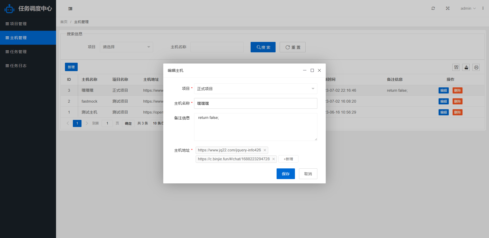
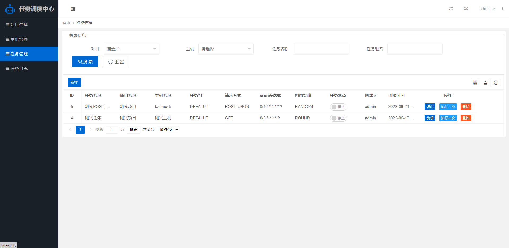
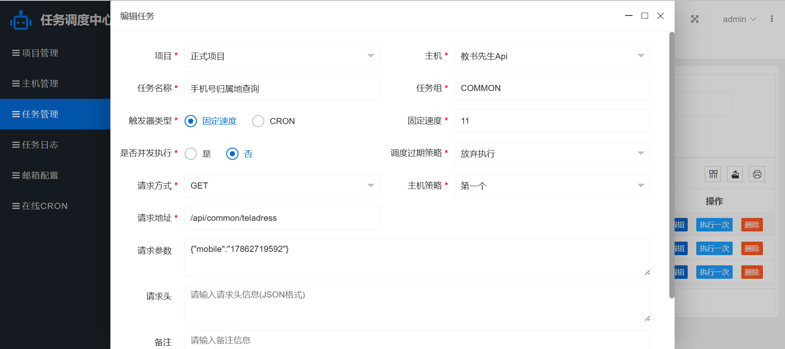
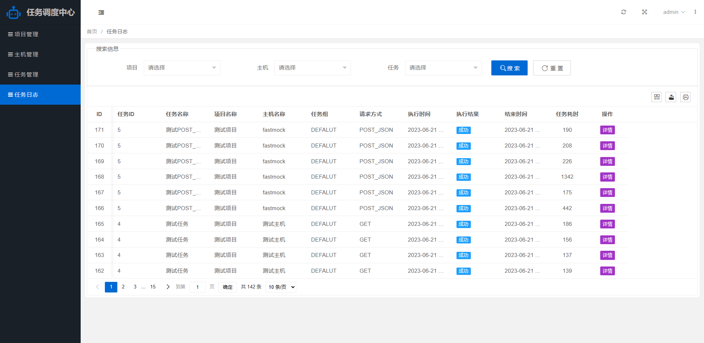
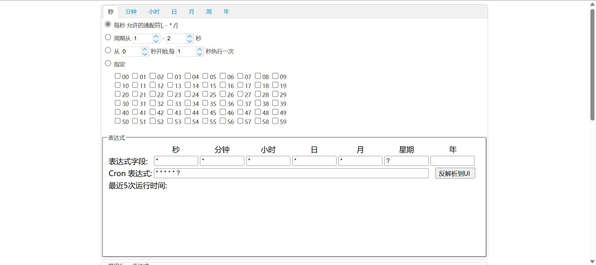

# Tiny Job
# 轻量级分布式定时任务调度系统

<a href='https://gitee.com/leisureLXY/tiny-job/stargazers'></img></a>
<a href='https://gitee.com/leisureLXY/tiny-job/members'></img></a>

> 一个基于SpringBoot+Quartz的的轻量级分布式定时任务调度系统

## 主要技术选型

1、后端：
- SpringBoot 2.6.11
- Quartz 2.3.2
- Mybatis-Plus 3.5.7
- Httpclient 4.5.13

2、前端：
- Layui 2.8.11
- jQuery 2.1.4

## 运行环境
- Jdk8
- MySQL5.6+

## 运行启动教程
1. 新建`MySQL`数据库并导入`sql`文件夹下的数据库脚本
2. 修改配置文件中`application.yml`中数据库连接信息
3. 运行启动类`TinyJobApplication`，即可正常启动项目
4. 管理后台登录地址：`http://localhost:9009`  账户密码 `admin / 123456`

## 平台功能
1、项目管理
- 增加项目维度，方便对主机信息和定时任务进行归类管理

2、主机管理
- 维护主机地址，一个主机信息可维护多个主机地址用于负载均衡，如 `http://172.89.56.117:8899`, `http://172.89.56.118:8899`
- 支持多种路由负载均衡策略（`FIRST`，`LAST`，`ROUND`，`RANDOM`，`LFU`，`LRU`），并提供标准化接口，可根据需要自行扩展
  - FIRST：第一个，固定选择第一个主机地址
  - LAST：最后一个，固定选择最后一个主机地址
  - ROUND：轮询，按顺序分别选择每一个主机地址
  - RANDOM：随机，随机选择所有可用的主机地址
  - LFU：最不经常使用，使用频率最低的主机地址优先被选举
  - LRU：最近最久未使用，最久未使用的主机地址优先被选举

3、任务管理
- 在线配置定时任务，包括新增任务、修改任务、删除任务、手动执行一次，以及实时启动/停止任务等功能，定时任务包括以下属性：
  - 所属项目：对应所属项目
  - 任务主机：对应主机信息
  - 任务名称：任务的名称
  - 任务组：任务的分组，只能由英文数字和下划线组成
  - 触发器类型：支持CRON和SIMPLE两种触发器(SIMPLE触发器即为按照固定秒数间隔执行的触发器)
  - Cron执行表达式：按照CRON内容，触发任务调度
  - 间隔时间(秒)：按照固定的间隔时间，周期性触发
  - 请求类型：`GET`,`POST`,`POST_JSON`
  - 请求路径：将和主机地址拼接，作为最终的任务请求地址
  - 请求参数：任务的请求参数信息，以标准JSON的格式配置
  - 请求头：任务的请求头信息，以标准JSON的格式配置
  - 主机路由策略：FIRST、LAST、ROUND、RANDOM等，详见主机管理里面的介绍
  - 调度过期策略：
    - 立即执行：调度过期后，将之前错过的未执行的全部执行
    - 执行一次：调度过期后，执行一次，并从当前时间开始重新计算下次触发时间；
    - 放弃执行(默认)：调度过期后，忽略过期的任务，从当前时间开始重新计算下次触发时间；
  - 是否并发执行：单机串行或者并发执行

4、任务执行日志
- 查询展示定时任务的历史执行记录信息
- 任务执行日志做签名完整性保护存储(国密3算法签名)

5、预警邮箱配置
- 配置预警邮箱用于接收任务失败时的预警消息

## 功能界面展示
首页

项目管理

项目管理-编辑

主机管理

主机管理-编辑

任务管理

任务管理-编辑

任务日志

CRON生成

## 常用cron表达式示例
- 0/2 * * * * ?   表示每2秒 执行任务

- 0 0/2 * * * ?   表示每2分钟 执行任务

- 0 0 2 1 * ?   表示在每月的1日的凌晨2点调整任务

- 0 15 10 ? * MON-FRI   表示周一到周五每天上午10:15执行作业

- 0 15 10 ? 6L 2002-2006   表示2002-2006年的每个月的最后一个星期五上午10:15执行作

- 0 0 10,14,16 * * ?   每天上午10点，下午2点，4点

- 0 0/30 9-17 * * ?   朝九晚五工作时间内每半小时

- 0 0 12 ? * WED    表示每个星期三中午12点

- 0 0 12 * * ?   每天中午12点触发

- 0 15 10 ? * *    每天上午10:15触发

- 0 15 10 * * ?     每天上午10:15触发

- 0 15 10 * * ?    每天上午10:15触发

- 0 15 10 * * ? 2005    2005年的每天上午10:15触发

- 0 * 14 * * ?     在每天下午2点到下午2:59期间的每1分钟触发

- 0 0/5 14 * * ?    在每天下午2点到下午2:55期间的每5分钟触发

- 0 0/5 14,18 * * ?     在每天下午2点到2:55期间和下午6点到6:55期间的每5分钟触发

- 0 0-5 14 * * ?    在每天下午2点到下午2:05期间的每1分钟触发

- 0 10,44 14 ? 3 WED    每年三月的星期三的下午2:10和2:44触发

- 0 15 10 ? * MON-FRI    周一至周五的上午10:15触发

- 0 15 10 15 * ?    每月15日上午10:15触发

- 0 15 10 L * ?    每月最后一日的上午10:15触发

- 0 15 10 ? * 6L    每月的最后一个星期五上午10:15触发

- 0 15 10 ? * 6L 2002-2005   2002年至2005年的每月的最后一个星期五上午10:15触发

- 0 15 10 ? * 6#3   每月的第三个星期五上午10:15触发